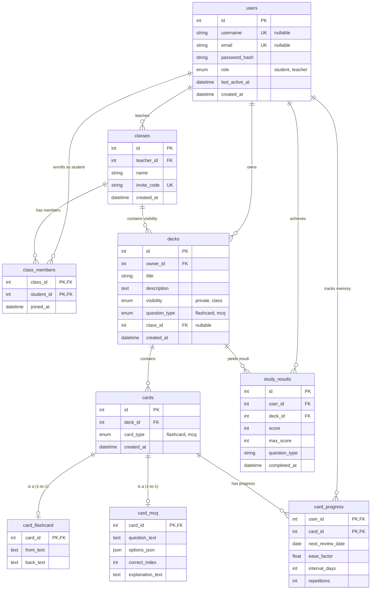

# Study App

Study App is a robust, interactive platform designed to help students and teachers create, manage, and study educational material efficiently. The application provides tools for teachers to manage classes and students to track their independent learning journeys using advanced spaced repetition algorithms and AI generation tools.

## Key Features

- **Role-Based Access Control**: Supports "Teacher" and "Student" roles, each with tailored dashboard views and permissions.
- **Dynamic Flashcards & Decks**: Create study decks with various card types, including standard flashcards, fill-in-the-gap, and multiple-choice questions (MCQ).
- **Classroom Management**: Teachers can create classes with unique 6-character invite codes and assign specific learning decks to their enrolled students. 
- **AI-Powered Card Generation**: Automatically generate rich MCQ flashcards from raw educational text using Google Gemini AI integrations.
- **Spaced Repetition System (SRS)**: Employs a sophisticated algorithmic review schedule ensuring long-term retention of study material.
- **In-Depth Progress Tracking**: View detailed statistics and graphical dashboards of study history, monitoring accuracy and consistency over time.

## Important Logical Functions

The core functionality of the application relies on several carefully designed algorithms and controllers:

### 1. Spaced Repetition Algorithm (`save_progress` in `app/routes/study.py`)
This evaluates a student's recall quality (on a scale of 0 to 5) to dynamically calculate the next review date for a specific card following a modified SuperMemo-2 style algorithm.
- **Repetitions & Intervals**: If the user scores poorly (quality < 3), repetitions reset, and the card's interval drops to 1 day. A successful sequence progressively increases the interval depending on the streak (e.g., 1 day -> 6 days -> `interval * ease_factor`).
- **Ease Factor (EF)**: A fractional multiplier initialized at 2.50. It dynamically adjusts up or down based on performance quality, enforcing a minimum EF of 1.3 to avoid interval stagnation.

### 2. AI Quiz Generation (`ai_generate` in `app/routes/decks.py`)
Leverages the `google.genai` SDK to automatically create Multiple Choice Questions from unstructured user-provided text.
- The function constructs a prompt containing the source text, desired difficulty, and question count, strictly instructing the Gemini model (`gemini-flash-latest`) to return a raw JSON response.
- Utilizing regex matching, it safely extracts and parses the JSON.
- Features automatic retry logic with exponential backoff for rate limits (HTTP 429 Error protection) before seeding the answers and explanations into the `CardMCQ` models.

### 3. Study Statistics Aggregation (`stats` in `app/routes/main.py`)
Compiles a student's `StudyResult` records into aggregate insights for the dashboard charts.
- **Accuracy Calculation**: Analyzes historical attempts on MCQ and Fill-in-the-Gap cards. A proportional score of > 50% on a specific card is validated as a successful point to compute overall study accuracy.
- **Monthly Distribution**: Aggregates the data month-by-month utilizing `calendar.monthrange` constrained by user-defined `start_date` and `end_date` parameters, creating a streamlined mapping arrays for chart rendering.

### 4. Secure Classroom Enrollment (`app/routes/classes.py`)
Handles the bridging logic between teachers and students.
- **Invite Codes**: `generate_invite_code()` dynamically rolls unique 6-character alphanumeric combinations, ensuring no duplicates exist in the database.
- **Access Verification**: During deck and class viewings, backend assertions check student enrollment via the `ClassMember` mapping table before granting access to class-specific, private study decks.

## Database Model

## Tech Stack
- **Backend Framework**: Flask (Python)
- **Database ORM**: SQLAlchemy with Flask-Migrate setup (`app.db` SQLite)
- **Authentication**: Flask-Login alongside Werkzeug Security hashing
- **AI Integration**: Google GenAI SDK

## Setup & Running Locally
1. Clone the repository and install dependencies using `pip install -r requirements.txt`.
2. Configure environmental variables (specifically `GEMINI_API_KEY`) within a `.env` file at the root.
3. Run the application locally via the entrypoint: `python run.py`.
